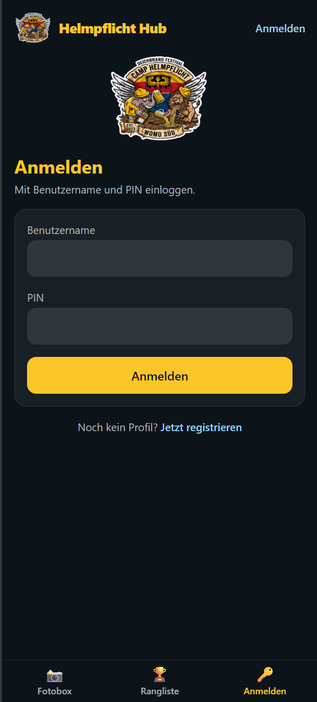
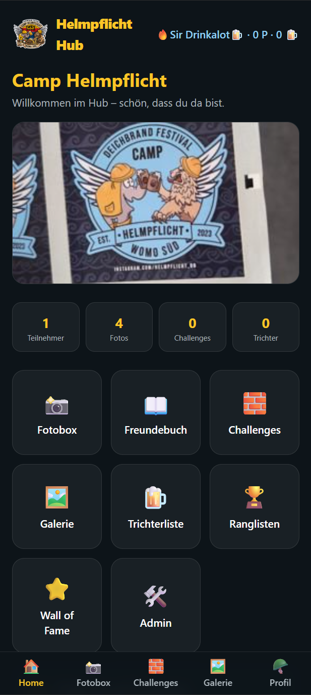
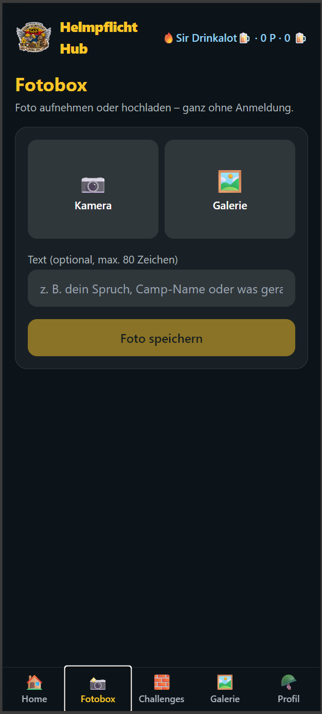
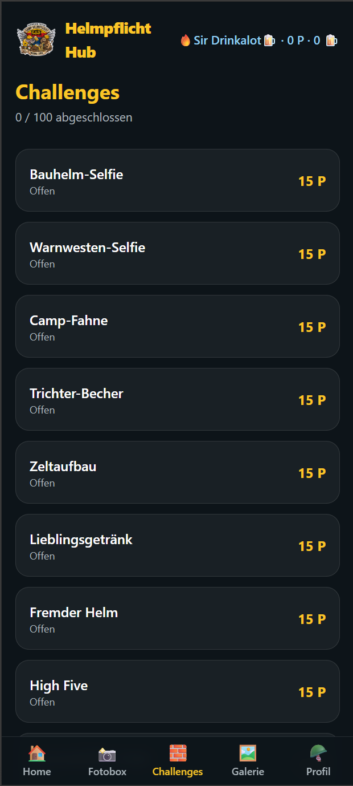
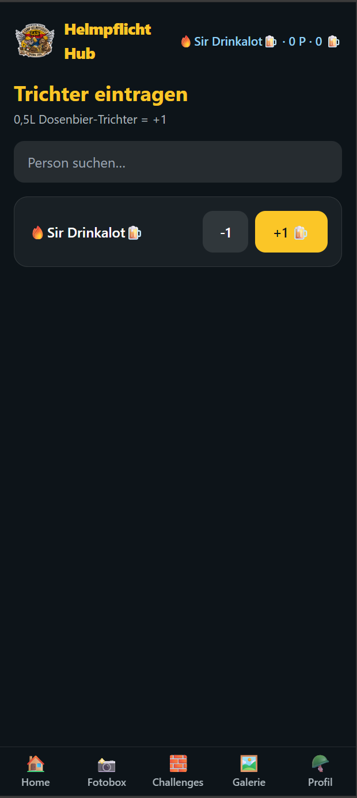

# Helmpflicht Hub

Lokale, offline-fähige Festival-Webanwendung für Camp Helmpflicht auf dem
Deichbrand Festival. PWA für Smartphones, läuft auf einem Rock 4C+ im
Camp-WLAN — zusätzlich per Cloudflare Tunnel auch von überall erreichbar
(siehe [docs/REMOTE_ACCESS.md](docs/REMOTE_ACCESS.md)).

## Screenshots

<table>
  <tr>
    <td align="center"> Anmelden</td>
    <td align="center"> Startseite</td>
    <td align="center"> Fotobox</td>
  </tr>
  <tr>
    <td align="center"> Challenges</td>
    <td align="center"> Trichterliste</td>
    <td></td>
  </tr>
</table>

## Dokumentation

Ausführliche Spezifikation und Betriebsanleitungen liegen in [`docs/`](docs/README.md):

- [PRD.md](docs/PRD.md) — Produktanforderungen
- [ARCHITECTURE.md](docs/ARCHITECTURE.md) — Systemarchitektur
- [DATABASE.md](docs/DATABASE.md) — Datenmodell
- [UI_UX.md](docs/UI_UX.md) — Design-Vorgaben
- [CHALLENGE_SYSTEM.md](docs/CHALLENGE_SYSTEM.md) — Challenges & Punkte
- [BADGES_AND_RANKS.md](docs/BADGES_AND_RANKS.md) — Badges & Ränge
- [DEPLOYMENT.md](docs/DEPLOYMENT.md) — Deployment auf dem Rock 4C+
- [REMOTE_ACCESS.md](docs/REMOTE_ACCESS.md) — Zugriff via Cloudflare Tunnel
- [ROCK_SETUP.md](ROCK_SETUP.md) — Schritt-für-Schritt Hardware-Setup

## Stack

FastAPI · React + TypeScript · TailwindCSS + shadcn/ui · SQLite · Docker Compose
